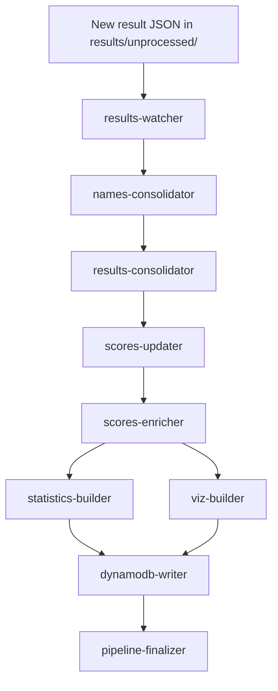

# toa-data-pipeline

This is the data pipeline for the Tournament of Albums (toa).

Results of tournament matches are dropped into an S3 bucket, which triggers the pipeline. The endpoint is a set of DynamoDB tables which serve the toa API.  

The main point of the pipeline is to apply the scoring algorithm to generate a score for each album.

## Happy path

See [state-machine](state-machine/) for the full flow, including the error paths.

## Lambdas

- **[results-watcher](results-watcher/)** — S3 trigger; starts the state machine on a new upload.
- **[names-consolidator](names-consolidator/)** — rebuilds `names/consolidated/names.parquet`, auto-generating short names.
- **[results-consolidator](results-consolidator/)** — merges new result JSONs into `results.parquet`; short-circuits to the finalizer if nothing new.
- **[scores-updater](scores-updater/)** — generates scores for each unscored date.
- **[scores-enricher](scores-enricher/)** — adds `rank` / `is_new` / `score_delta` columns.
- **[statistics-builder](statistics-builder/)** — computes global summary statistics.
- **[viz-builder](viz-builder/)** — builds the score-history visualization dataset (largest connected component).
- **[dynamodb-writer](dynamodb-writer/)** — writes the Parquet outputs to the DynamoDB tables.
- **[pipeline-finalizer](pipeline-finalizer/)** — terminal step; logs success or failure.

## Related projects

These live in their own repositories.

- [toa-lambda-layer-common](https://github.com/tor-gu/toa-lambda-layer-common) — shared layer attached to every Lambda here: logging, column names, S3 paths.
- [toa-lambda-score](https://github.com/tor-gu/toa-lambda-score) — computes the album scores, invoked by scores-updater once per date being scored.

