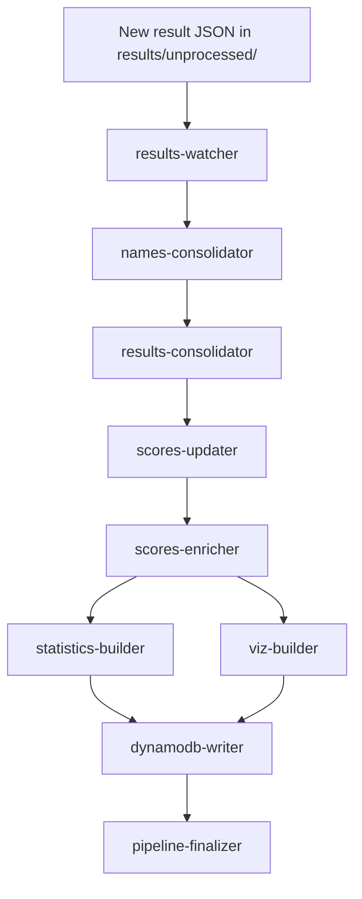

# toa-data-pipeline

Monorepo of AWS Lambdas that turn an uploaded match result into fitted scores
and the derived Parquet, DynamoDB, and visualization datasets. The functions are
orchestrated by a Step Functions state machine (`state-machine/`), kicked off by
`results-watcher` when a new result JSON lands in S3 under
`results/unprocessed/`.

## Happy path

## Lambdas

- **results-watcher** — S3 trigger; starts the state machine on a new upload.
- **names-consolidator** — rebuilds `names/consolidated/names.parquet`, auto-generating short names.
- **results-consolidator** — merges new result JSONs into `results.parquet`; short-circuits to the finalizer if nothing new.
- **scores-updater** — generates scores for each unscored date.
- **scores-enricher** — adds `rank` / `is_new` / `score_delta` columns.
- **statistics-builder** — computes global summary statistics.
- **viz-builder** — builds the score-history visualization dataset (largest connected component).
- **dynamodb-writer** — writes the Parquet outputs to the DynamoDB tables.
- **pipeline-finalizer** — terminal step; logs success or failure.

