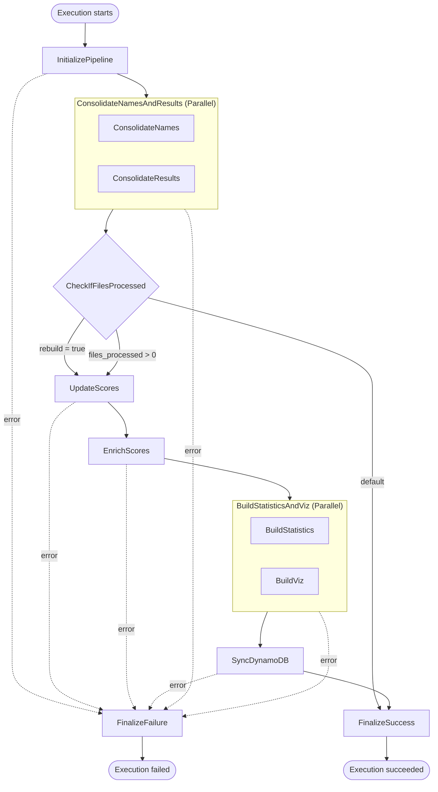

# state-machine

This is the AWS Step Functions state machine definition that drives the pipeline. The `state_machine.json.tftpl` file is a terraform template.

## Flow



## Notes

Every task retries `Lambda.TooManyRequestsException` — 10 attempts from 5s with a
backoff rate of 2 — and catches `States.ALL` to `FinalizeFailure`, which logs the
error and then transitions to a `Fail` state.

Neither `Parallel` state's branches have a `Catch` of their own; the `Parallel`
state catches for both, so a failure in either branch aborts the pair.

`FinalizeSuccess` and `FinalizeFailure` have no `Retry` or `Catch`. An error in
either fails the execution directly.

`InitializePipeline` writes its output to `$`, replacing the raw execution input with the
normalized one. Every later reference to `$.rebuild` and `$.num_executors` reads what that
state produced.

`ConsolidateNamesAndResults` writes its output to `$.consolidated` rather than `$`, so
that the normalized input — `rebuild` and `num_executors` — is still there when the later
states need it.

## Execution input

```json
{ "rebuild": false, "num_executors": 1 }
```

Both fields are optional and both are normalized by
[pipeline-initializer](../pipeline-initializer/) before anything else runs, so an
execution started with `{}` behaves exactly like one started by results-watcher.

| Field | Default | Notes |
|---|---|---|
| `rebuild` | `false` | must be a boolean; see [Rebuild](#rebuild) |
| `num_executors` | `1` | must be an integer ≥ 1; how many score-Lambda invocations scores-updater keeps in flight at once |

Values are validated, not coerced — `{"rebuild": "yes"}` and `{"num_executors": 0}` fail
the execution through `FinalizeFailure` instead of running with a silently wrong setting.
Unknown fields are dropped, since the state replaces `$` outright.

The one input the initializer cannot report cleanly is a non-object: an execution started
with a bare string or array fails with `States.ResultPathMatchFailure`, because the
`Catch` has nothing to merge `$.error` into. No real caller does this.

## Rebuild

A rebuild recomputes everything from the consolidated Parquet data, instead of only the
dates touched by the newly uploaded results. Nothing needs to be sitting in
`results/unprocessed/` — the input to a rebuild is what has already been consolidated.

Start one by hand:

```bash
cd toa-terraform/environments/prod   # or test
aws stepfunctions start-execution \
  --state-machine-arn "$(terraform output -raw state_machine_arn)" \
  --input '{"rebuild": true}'
```

**timeouts.** A rebuild invokes the score Lambda once per scored
date, and each fit covers every match up to that date, so the work grows roughly
quadratically with the number of dates.

A measured rebuild took **489s for 181 dates**. Extrapolating quadratically from that
(~0.0149 · n² seconds), `scores-updater`'s `timeout = 600` covers around 200 dates, and
the Lambda hard ceiling of 900s would cover around 245.

Those numbers are for the default `num_executors: 1`, where the fits run one at a time.
The score Lambda is a separate function with no reserved concurrency, so a bigger
`num_executors` overlaps the fits and cuts the wall clock — sub-linearly, since the
longest date still has to run start to finish:

```bash
aws stepfunctions start-execution \
  --state-machine-arn "$(terraform output -raw state_machine_arn)" \
  --input '{"rebuild": true, "num_executors": 4}'
```

See [scores-updater](../scores-updater/README.md) for what to watch when raising it.

## Simultaneous uploads

The normal use case is that results are uploaded one -- or perhaps a few -- at a time. A large burst of results might be uploaded in a test environment, or when reloading all the data from scratch (for some reason).  This section describes what happens when multiple results are uploaded simultaneously, or nearly so.

**Each upload triggers a run of the state machine**. There are two mechanisms to keep that safe.

**Concurrency limiting.** Every pipeline Lambda except results-watcher,
pipeline-initializer and pipeline-finalizer is capped at
`reserved_concurrent_executions = 1`. A second
concurrent invocation is throttled with `Lambda.TooManyRequestsException` — which triggers a retry. So, overlapping executions serialize a step at a time.

**Short-circuiting.** results-consolidator takes everything in
`results/unprocessed/`, not just the file that triggered it. Executions behind it find nothing, return `files_processed: 0`, and jump to the finalizer.

As long as every execution succeeds (eventually), the end state is correct. 

### Gap: retries exhausted waiting for a post-consolidation lambda to complete

If a large number of results are uploaded in rapid succession, it is conceivable that overlapping executions queue up at some step after `results-consolidator` waiting for a lambda (e.g. `scores-updater`) to complete. If the retry budget is eventually exhausted, results will have been consolidated and moved to the `processed` folder, without being processed all the way to the end. If no subsequently handled results have an earlier date, they will never be processed.

This scenario would involve 10 attempts spanning about 85 minutes. It would be reported as a pipeline FAILURE.

Recovery is a [rebuild](#rebuild) — `--input '{"rebuild": true}'` reprocesses everything
that has been consolidated.
