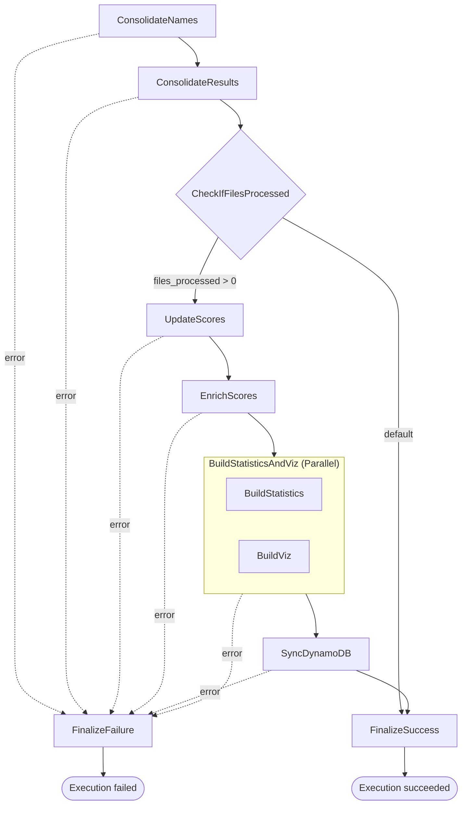

# state-machine

The Step Functions definition that drives the pipeline. The `state_machine.json.tftpl` file is a terraform template.

## Flow

## Notes

Every task retries `Lambda.TooManyRequestsException` — 10 attempts from 5s with a
backoff rate of 2 — and catches `States.ALL` to `FinalizeFailure`, which logs the
error and then transitions to a `Fail` state.

The two parallel branches have no `Catch` of their own; the `Parallel` state catches
for both, so a failure in either aborts the pair.

`FinalizeSuccess` and `FinalizeFailure` have no `Retry` or `Catch`. An error in
either fails the execution directly.
